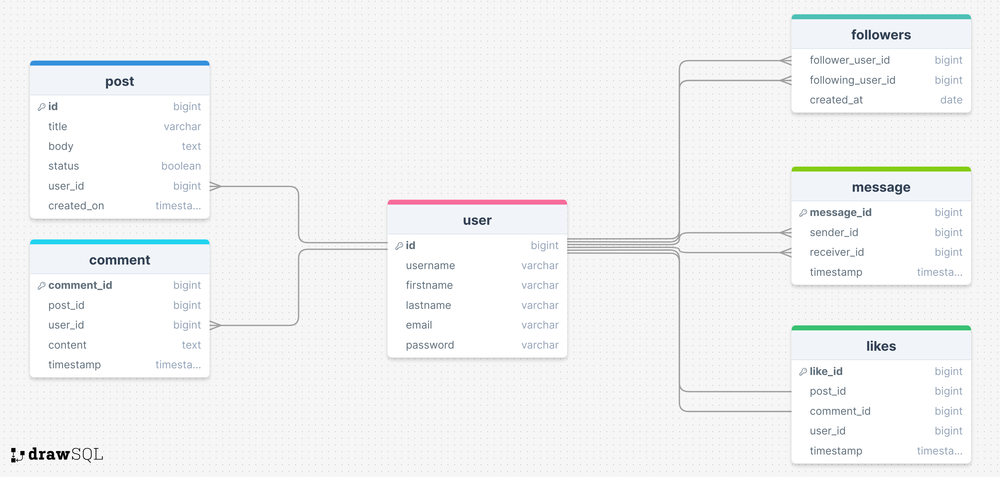

# Social Media Platform Backend

## Setup Instructions for Linux
### Follow the given step for setting up for the project for linux:
- Keep docker running in the background
`sudo docker-compose up --build -d` OR
- Keep docker running in the foreground to check the logs
`sudo docker-compose up --build`

### Command to use the PSQL Shell
`sudo docker exec -it ys121_be_task_db_1 psql -U postgres -d ys121_be_task`

## Setup Instructions Locally without Docker
### Setting up the Database:
1. Install PostgreSQL
2. Create a database named `ys121_be_task`
3. Run the SQL script `db.sql` to create the tables and insert the data
`psql -U postgres -d ys121_be_task -a -f db.sql`
4. Update the database url in the `.env` file

### Setting up the Project:
1. Install the required dependencies
`npm install`
2. Start the server
`npm start` or `node server.js`

## Database ER Diagram

